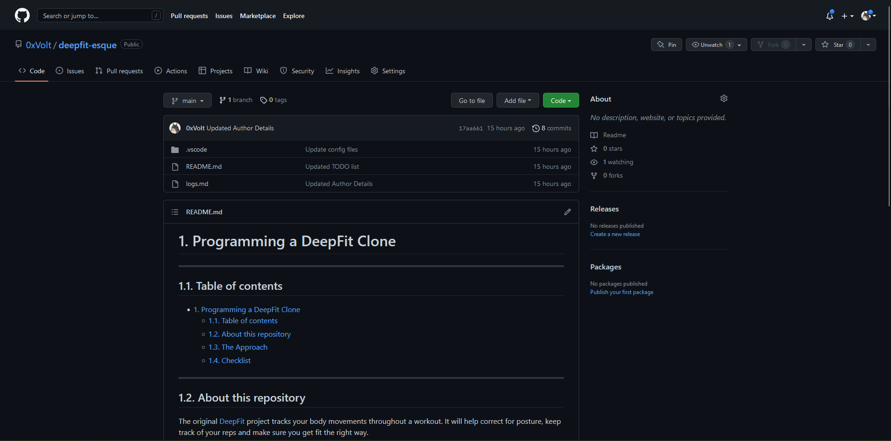
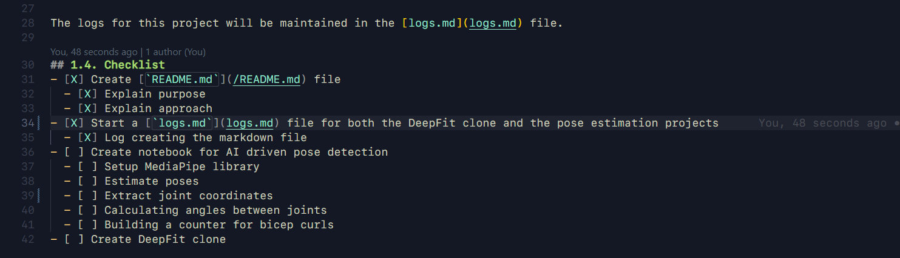

# DeepFit Clone Project Logs

---

## Author Details
###### Name: **Desh Iyer**
###### Identifiers: **Programming a DeepFit Clone & Creating**
###### File Name: [**deepfit.ipynb**](/deepfit.ipynb)
###### Script Name: [**deepfit.ipynb**](/deepfit.ipynb)

---

###### Date: **26-07-2022** | Time: **18:00 - 23:00**
1. Created [this](https://github.com/0xVolt/deepfit-esque) repository to host all the programs relevant to this project. 
2. Wrote the [README.md](/README.md) file for this project describing its purpose and the tasks to accomplish.  
3. Started [this](logs.md) log file to log the daily progress made on this project.  