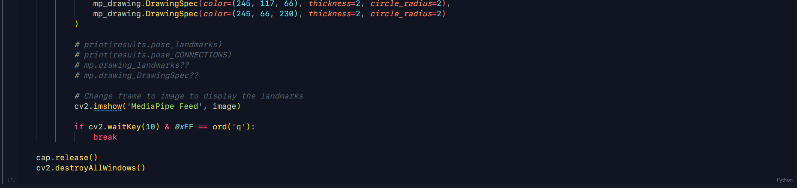

# DeepFit Clone Project Logs

## Author Details
###### Name: **Desh Iyer**
###### Identifiers: **Programming a DeepFit Clone & Creating**
###### File Name: [**deepfit.ipynb**](/deepfit.ipynb)
###### Script Name: [**deepfit.ipynb**](/deepfit.ipynb)

---

###### Date: **26-07-2022** | Time: **18:00 - 23:00**
1. Created [this](https://github.com/0xVolt/deepfit-esque) repository to host all the programs relevant to this project. 
2. Wrote the [`README.md`](/README.md) file for this project describing its purpose and the tasks to accomplish.  
3. Started the [`logs.md`](logs.md) log file to log the daily progress made on this project.  
4. Began the sub-project on pose estimation using MediaPipe and OpenCV. All the code is in the [`pose-estimation.ipynb`](pose-estimation.ipynb) notebook. The last part of the pose estimation program, i.e., building a bicep curl counter, remains to be implemented. This is what has been implemented so far.           

---

###### Date: **27-07-2022** | Time: **13:00 - 15:00**